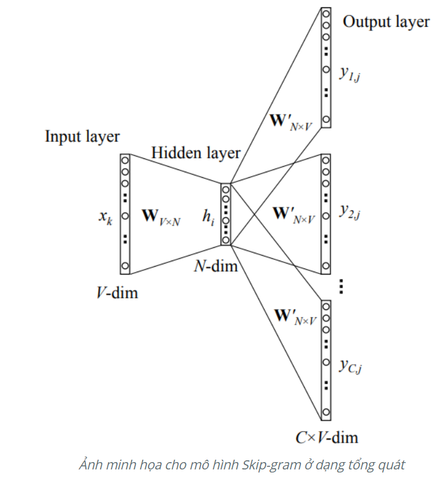
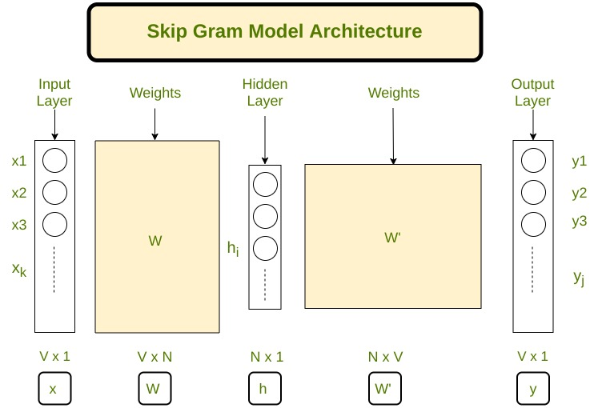
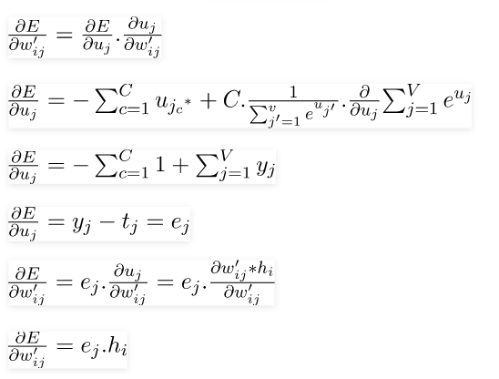
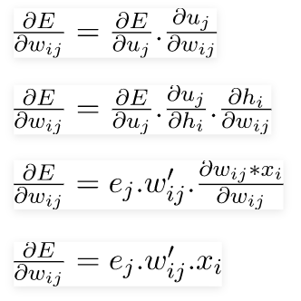

# 1. Là một cách huấn luyện của Word2vec với: Từ mục tiêu sẽ là đầu vào và các từ ngữ cảnh sẽ là đầu ra.
Với từ mục tiêu là $w_{c}$ thì các từ ngữ cảnh sẽ là $(w_{c-m},...,w_{c-1},w_{c+1},...w_{c+m})$ . Với m là kích thước của cửa sổ.

Ex: Con "sẽ" về nhà đúng giờ
- c = 2, m = 1
- Input: sẽ
- Label: Con, về

## Cách hoạt động:

Trong đó:
- V (V-dim) là kích thước của tập từ vựng
- N (N-dim) là kích thước của hidden layer
- h là hidden layer
- $y_{i,j}$ là label đã được qua softmax

Ta có:   $P(w_{c,j} = w_{O,c} | w_{I}) = y_{c,j} = \frac{e^{u_{c,j}}}{\sum_{{i=1}}^{V}e^{u_{i}}}$
    
Trong đó: 
- $h = v_{w_{I}}^{T}$ với $v_{w_{I}}^{T}$ là vecto đại diện tương ứng từ thứ i trong tập từ vựng N => h có kích thước (N x 1)
- $ u_{c,j} = u_{j} = (v_{w_{j}}^{'})^{T}.h$ ( c chạy từ 1....C ) với $v_{w_{j}}^{'}$ là vector đầu ra của từ thứ j trong tập từ vựng $w_{j}$ và lấy cột tương ứng của ma trận trọng số W'

Viết lại:  $max(P) = max(log(P)) = min(-log(P))$

   <=> $E = -log[P(w_{O,1},w_{O,2},..w_{O,C}|w_{I})] = - log[p(w_{O,1}|w_{I})*p(w_{O,2}|w_{I})..p(w_{O,C}|w_{I})] = -log(\prod_{c=1}^{C}\frac{e^{u_{c,j_{c}^{*}}}}{\sum_{{i=1}}^{V}e^{u_{i}}}) = \sum_{{i=1}}^{C}e^{u_{j_{c}^{*}}} + C.log\sum_{{i=1}}^{V}e^{u_{i}}$

Cập nhật lại các u dùng gradient descent

# 2. Implement skip-gram
## 2.1 Create trainset
Từ một đoạn text Corpus sẽ được preprocessing để trở thành traning samples như hình sau:

Một số biến được định nghĩa:
- N: số lượng từ unique trong courpus (Vocabulary)
- x: là input đã được One hot encoding
- N: Số lượng Neuron trong lớp hidden
- W: Trọng số giữa input và hidden
- W': Trọng số giữa hidden và output
- y: Là output đã được softmax 

Kiến trúc mô hình SKIP-GRAM có dạng:

## 2.1 Forward Propagation
$h = W^{T}.x$  
$u = W^{'T}.h$  
$u_{j} = V_{w_{ij}}^{T}.h$  
   Trong đó:
   - $u_{j}$ là giá trị thứ j của u (1x1)
   - $w_{j}$ là từ thứ j trong tập vocab với j là bất kì index nào  
   - $V_{w_{j}}$ là cột thứ j của W' => Đại diện cho word $w_{j}$  (Nx1)
 

$P(w_{j}|w_{i}) = y_{j} = \frac{e^{u_{j}}}{\sum_{{t=1}}^{V}e^{u_{t}}} $  
Với P là xác suất rằng $w_{j}$ là một ngữ cảnh với $w_{i}$ là từ đầu vào.
- Mà mục tiêu là đi Maximum $P(w_{j*}|w_{i})$ với j* là đại diện cho chỉ số của các từ ngữ cảnh.  
- Hay là $Max(\prod_{c=1}^{C}\frac{e^{u_{j_{c}^{*}}}}{\sum_{{t=1}}^{V}e^{u_{t}}})$

Với $j*_{c}$ là chỉ mục của vocab của từ ngữ cảnh. Ngữ cảnh chạy từ c =1 đến C.  
Sau khi tiến hành Log likelihood ta được loss function:

$E = -log{\{\prod_{c=1}^{C}\frac{e^{u_{j_{c}^{*}}}}{\sum_{{t=1}}^{V}e^{u_{t}}}\}} = \sum_{{i=1}}^{C}u_{j_{c}^{*}} + C.log\sum_{{t=1}}^{V}e^{u_{t}}$

## 2.3. Back Propagation
Chỉ cần tìm hai cái đạo hàm của $\frac{\delta E}{\delta W'}$ và $\frac{\delta E}{\delta W}$
Có thể tham khảo công thức sau:

